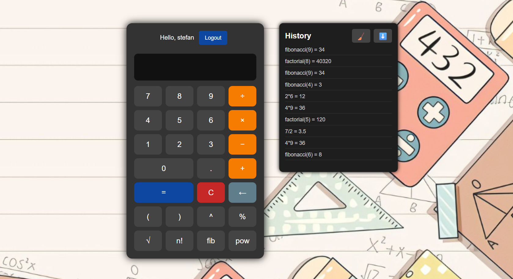
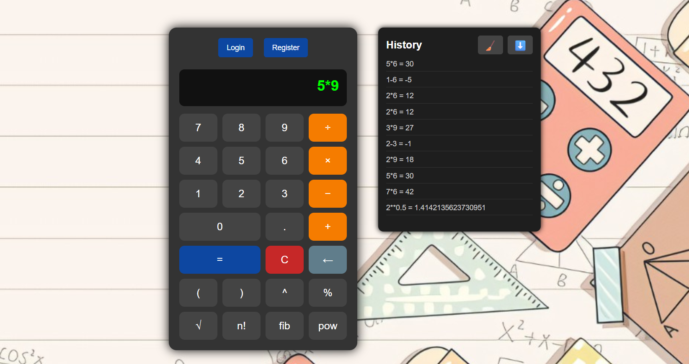

# Calculator Microservice

## Descriere generală

Acest proiect este un microserviciu de calculator matematic, dezvoltat cu **FastAPI**, care oferă atât o interfață web modernă, cât și un API REST pentru operații matematice de bază și avansate. Soluția respectă principii moderne de proiectare (MVC/MVCS), este containerizată, extensibilă și pregătită pentru deploy în cloud.

---

## Structura proiectului

- **app/**
  - **api/**: Rute pentru operațiile matematice și interfața web.
  - **auth/**: Autentificare JWT, login, înregistrare, utilitare.
  - **core/**: Configuri centrale (logging, redis, messaging).
  - **db/**: Inițializare și sesiune bază de date (SQLAlchemy).
  - **models/**: Modele ORM (user, request).
  - **schemas/**: Validare și schematizare date (Pydantic).
  - **services/**: Logica de business pentru operații matematice (async, caching).
  - **static/**: Resurse frontend (CSS, JS, imagini).
  - **templates/**: Pagini HTML (Jinja2: index, login, register).
- **tests/**: Teste unitare și de integrare.
- **k8s/**: Fișiere YAML pentru deploy Kubernetes.
- **run.py**: Entry point pentru rulare locală.
- **requirements.txt**: Dependențe proiect.
- **Dockerfile / docker-compose.yaml**: Pentru rulare containerizată.

---

## Funcționalități principale

- ✔️ Operații matematice de bază și avansate (`pow`, `factorial`, `fibonacci`), accesibile prin API REST sau interfață web.
- ✔️ Interfață web modernă, cu stilizare CSS și JS SPA-like.
- ✔️ Autentificare și înregistrare utilizatori (JWT).
- ✔️ Persistență completă: toate cererile de calcul se salvează în baza de date, cu istoric per user sau anonim.
- ✔️ Export CSV pentru istoric (user sau anonim).
- ✔️ Ștergere istoric individual (user sau anonim).
- ✔️ Caching Redis pentru operații costisitoare.
- ✔️ Logging centralizat (configurabil, production ready).
- ✔️ Deploy cloud ready: Docker/K8s/Cloud.
- ✔️ Persistență în Redis Streams: fiecare request matematic este publicat și într-un stream Redis (pentru bonus/monitorizare/integrare cu microservicii).

---

## Tehnologii folosite

- Python 3, FastAPI, SQLAlchemy (async)
- SQLite (ușor de înlocuit cu orice SQL/NoSQL)
- Redis (cache și streaming)
- Docker, Docker Compose, Kubernetes (K8s)
- Pytest (testare automată)

---

## Instrucțiuni de rulare local

1. Instalează dependențele:
    ```bash
    pip install -r requirements.txt
    ```
2. Pornește aplicația:
    ```bash
    python run.py
    ```
3. Accesează:
    - [http://localhost:8000/](http://localhost:8000/) — interfață web
    - [http://localhost:8000/docs](http://localhost:8000/docs) — Swagger/OpenAPI

---

## Deploy cu Docker & Google Cloud

**Aplicația este containerizată și poate fi rulată oriunde există Docker/K8s. A fost deja deployată cu succes pe Google Cloud Platform.**

### Local cu Docker:
```bash
docker build -t calculator-fastapi .
docker run -d -p 8000:8000 calculator-fastapi
```

### În cloud (ex: GCP/GKE):
- Folosește fișierele din folderul **k8s/** pentru deploy rapid în Kubernetes.
- Aplicația se conectează automat la serviciul Redis din cluster pentru cache & streaming.

---

## Funcționalități extinse (Bonusuri implementate)

- **Persistență în Redis Streams:** Fiecare request matematic este publicat și într-un stream Redis (`calc_requests`) pentru monitorizare, analytics sau integrare cu alte microservicii.
- **Cloud native & deploy:** Structură modulară, containerizare, YAML pentru K8s, deploy live pe GCP.
- **Extensibilitate:** Adaugi rapid alte operații matematice, endpointuri noi sau integrare cu alți provideri cloud.
- **Testare automatizată:** Teste unitare în folderul `tests/`.

---

## Demo Online

Aplicația live: [http://34.56.34.63/](http://34.56.34.63/)  
*(actualizează cu URL-ul tău real dacă e nevoie)*

---



---

